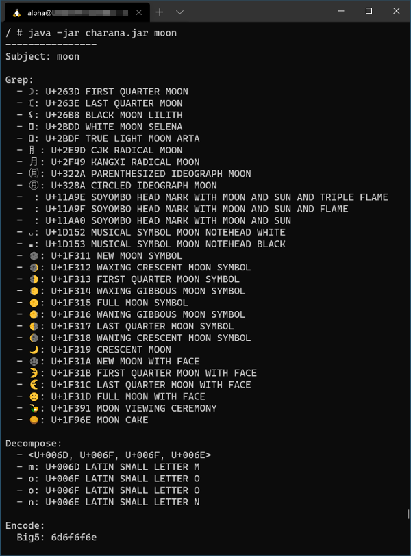
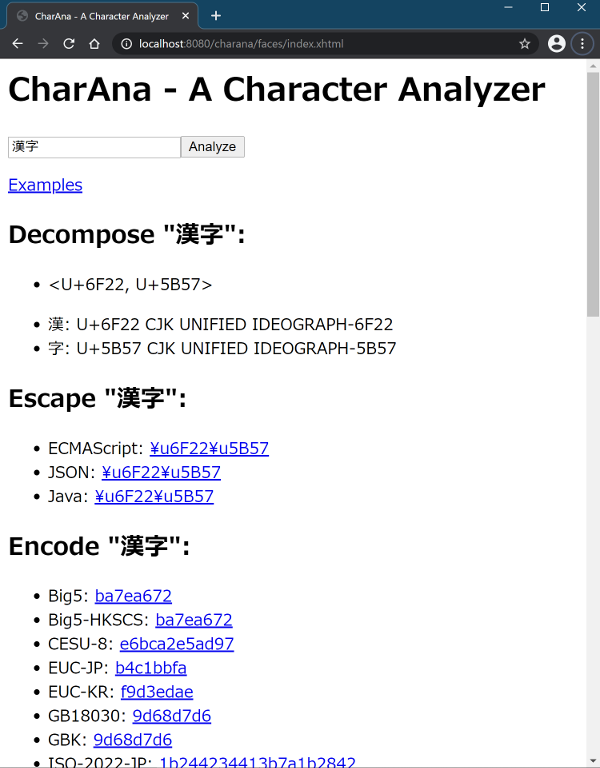

# What is CharAna?

CharAna is a simple character analyzer, written in Java. It accepts a sequence of characters, or in other words, a string. It can be useful to know:

- What code points the string consists of (漢字 → <U+6F22, U+5B57>)
- What the code point notation represents (<U+6F22, U+5B57> → 漢字)
- What is the escaped form of the string (漢字 → \u6F22\u5B57)
- What are the characters the escaped string represents (\u6F22\u5B57 → 漢字)
- What are the possible encodings for the string (漢字 → UTF-8:e6bca2e5ad97)
- What characters the hexadecimal string represents (e6bca2e5ad97 → UTF-8:漢字)
- What characters contain the name (calendar → 📅,📆,🗓)

## CharAna Core

CharAna Core is a library of analytical methods for a string. It's just a thin wrapper of standard Java APIs. The library is used from CharAna CLI and WAR.

## How to build CharAna Core

Go to the `charana-core` directory, and `install` it with Maven. Since the CLI and WAR mentioned below depend on this core library, `mvn package` will not suffice.

    cd charana/charana-core
    mvn install

## CharAna CLI

CharAna CLI is a simple command-line interface for CharAna.

## How to build CharAna CLI

Go to the `charana-cli` directory, and build with `mvn package`.

    cd charana/charana-cli
    mvn package

## How to run CharAna CLI

Go to the `target` directory under `charana-cli`.

    cd charana/charana-cli/target

There should be two JARs. `charana-cli-x.x.x.jar` contains only a small main class, which requires several depending JARs to be executed. `charana-cli-x.x.x-jar-with-dependencies.jar` is a "fat" JAR, which contains all necessary classes to go. So basically you can use the latter one. It takes a variable number of strings to analyze as arguments.

    java -jar charana-cli-*-jar-with-dependencies.jar 漢字

## CharAna WAR

CharAna WAR is a web application interface, and REST APIs for CharAna. It's a JaveEE 8 application.

## How to build CharAna WAR

Go to the `charana-war` directory, and build with `mvn package`.

    cd charana/charana-war
    mvn package

## How to run CharAna WAR

Assume that you have installed GlassFish on your machine. Suppose the `bin` directory of GlassFish home is in the `PATH` environment variable.

Start the GlassFish server.

    asadmin start-domain

Go to the `target` directory under `charana-war`, and deploy the WAR specifying the context root.

    cd charana/charana-war/target
    asadmin deploy --contextroot charana charana-war-*.war

Now you can get to the web page through the URL.

    http://localhost:8080/charana/faces/index.xhtml
